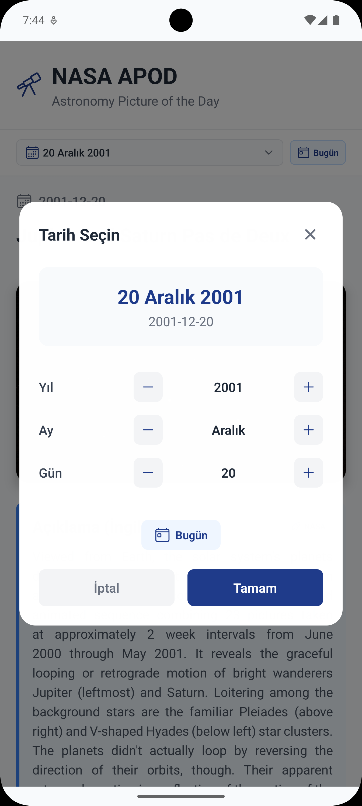
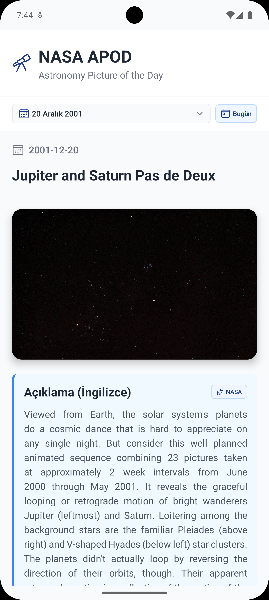
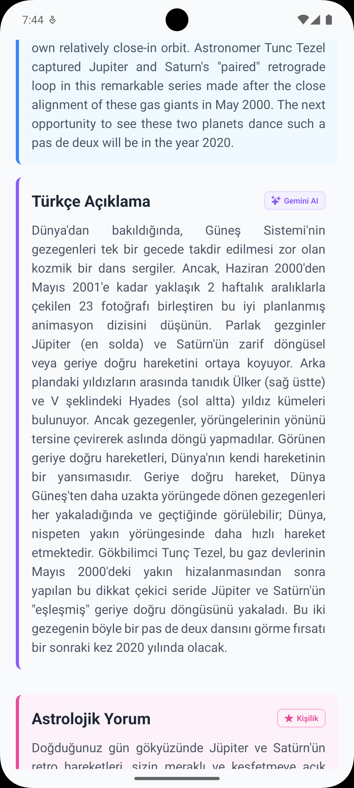
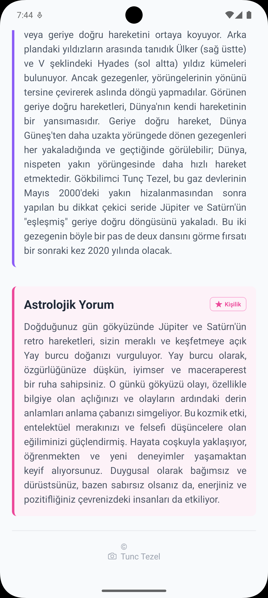

# 🌌 SpaceApp - NASA APOD Keşif Uygulaması

NASA'nın Günlük Astronomi Resimlerini AI destekli Türkçe çeviriler ve kişiselleştirilmiş astrolojik yorumlarla sunan React Native uygulaması.

## Özellikler

-  **Tarih Seçici**: 1995'ten beri tüm NASA APOD arşivini gezin
-  **NASA APOD Entegrasyonu**: Yüksek kaliteli astronomi resimleri ve açıklamaları
-  **AI Destekli Çeviriler**: Gemini AI ile otomatik Türkçe çeviri
-  **Astrolojik İçgörüler**: Burç tabanlı kişiselleştirilmiş kişilik analizi
-  **Modern Arayüz**: Temiz, renkli tasarım ve sezgisel navigasyon
-  **Çapraz Platform**: React Native ve Expo ile geliştirildi

##  Ekran Görüntüleri

<table>
  <tr>
    <td align="center">
      
      <br>
      <b>Tarih Seçici</b>
      <br>
      <em>NASA APOD arşivinden herhangi bir tarihi seçin</em>
    </td>
    <td align="center">
      
      <br>
      <b>Ana Arayüz</b>
      <br>
      <em>Kapsamlı bilgilerle birlikte güzel astronomi fotoğrafı</em>
    </td>
  </tr>
  <tr>
    <td align="center">
      
      <br>
      <b>Çok Dilli Destek</b>
      <br>
      <em>Orijinal İngilizce açıklamalar ve AI destekli Türkçe çeviriler</em>
    </td>
    <td align="center">
      
      <br>
      <b>Astrolojik İçgörüler</b>
      <br>
      <em>Seçilen tarihe dayalı kişiselleştirilmiş astrolojik analiz</em>
    </td>
  </tr>
</table>

##  Teknolojiler

- **Frontend**: React Native, Expo
- **API'ler**:
  - NASA APOD API
  - Google Gemini AI API
- **Özellikler**: Tarih navigasyonu, AI çevirileri, Astrolojik yorumlar

##  Başlangıç

### Gereksinimler

- Node.js (v16 veya üzeri)
- Expo CLI
- NASA API Anahtarı
- Google Gemini API Anahtarı

### Kurulum

1. Depoyu klonlayın:

```bash
git clone https://github.com/halilbalik/SpaceApp.git
cd SpaceApp
```

2. Bağımlılıkları yükleyin:

```bash
npm install
```

3. Şablondan `appsettings.json` oluşturun:

```bash
cp appsettings.example.json appsettings.json
```

4. API anahtarlarınızı `appsettings.json`'a ekleyin:

```json
{
  "NASA_API_KEY": "nasa_api_anahtarınız",
  "NASA_API_BASE_URL": "https://api.nasa.gov/planetary/apod",
  "GEMINI_API_KEY": "gemini_api_anahtarınız",
  "GEMINI_API_BASE_URL": "https://generativelanguage.googleapis.com/v1beta/models/gemini-2.0-flash:generateContent"
}
```

5. Geliştirme sunucusunu başlatın:

```bash
npm start
```

##  API Anahtarları

### NASA API Anahtarı

Ücretsiz API anahtarınızı [NASA API Portal](https://api.nasa.gov/) adresinden alın

### Google Gemini API Anahtarı

API anahtarınızı [Google AI Studio](https://makersuite.google.com/app/apikey) adresinden alın

### Kullanıcı Deneyimi

- **Renkle Kodlanmış Bölümler**:
  - 🔵 Orijinal NASA içeriği için mavi
  - 🟣 AI çevirileri için mor
  - 🌸 Astrolojik içgörüler için pembe
- **Duyarlı Tasarım**: Mobil cihazlar için optimize edilmiş
- **Yükleme Durumları**: Akıcı geçişler ve yükleme göstergeleri
